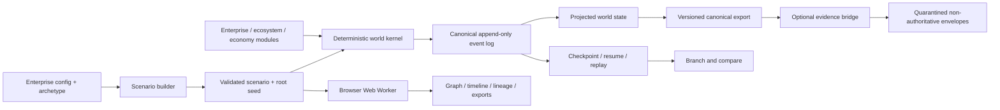

# Aether Simulator

Aether is research software for building deterministic, fictional enterprise
worlds. It supports reproducible simulation, testing, and research. It is not
production-ready, live accepted, a compliance product, or a legal or regulatory
authority.

## Product-depth thesis

1. **Enterprise depth** - one realistic synthetic enterprise.
2. **Ecosystem depth** - enterprises interacting with customers, vendors,
   workers, institutions, and service providers.
3. **Economy depth** - many enterprises and citizens interacting through
   employment, consumption, supply chains, finance, taxation, regulation,
   business formation, failure, and shocks.

This repository implements the deterministic world kernel, configurable
Enterprise Depth, contract-gated Ecosystem Depth, and entity-derived Economy
Depth research scenarios. It also includes a static browser studio that runs
the same kernel locally in a Web Worker.

## What is implemented

- Versioned JSON contracts for scenarios, events, worlds, checkpoints, and
  exports.
- A deterministic clock, stable event scheduler, cryptographic identifiers,
  and namespaced random substreams.
- Deterministic module lifecycle hooks, append-only events, projections,
  replay, checkpoint/resume, branching, and comparison.
- Five enterprise archetypes: professional services, SaaS, retail, logistics,
  and manufacturing.
- Stateful customer, employee, procurement, fulfilment, finance, data-lineage,
  incident, remediation, and intervention journeys.
- Enforced accounting, inventory, capacity, payroll, invoice, workflow, and
  lineage invariants.
- Deterministic multi-organization contracts, intermediated payments,
  deliveries, shared-citizen contexts, record transfers, and causal cascades.
- Synthetic citizens, households, firms, nonprofits, banks, government,
  regulators, markets, credit, taxation, public expenditure, shocks, formation,
  failure, and event-derived aggregate metrics.
- Deterministic migration from the public `aether-world.v0.1` fixture.
- An optional evidence bridge that converts synthetic lineage observations into
  quarantined, facts-only, non-authoritative envelopes.
- A credential-free browser studio for configuration, local execution, graph
  and timeline inspection, replay, checkpoint/resume, branching, comparison,
  lineage review, and canonical export.

Worker-parallel execution, local OSS realism, and connected calibration remain
future research. Enterprise-only customer and supplier entries remain boundary
contexts; Ecosystem Depth scenarios independently simulate declared
counterparties. Connected-provider performance is not universally validated.

## Five-minute demonstration

Requires Node.js 20 or newer. Docker, credentials, and network services are not
required.

```bash
npm ci
npm run demo
npm run demo:enterprise
npm run demo:ecosystem
npm run demo:economy
npm run verify:ci
```

The demonstration writes `fixtures/kernel-baseline.export.json` and
`fixtures/kernel-baseline.evidence.json`. Re-running it with the same scenario,
contract version, and seed produces byte-identical output.

The CLI can also run individual lifecycle operations:

```bash
node src/cli.mjs validate scenarios/kernel-baseline.json
node src/cli.mjs run scenarios/kernel-baseline.json
node src/cli.mjs checkpoint scenarios/kernel-baseline.json --tick 2
node src/cli.mjs enterprise-run scenarios/enterprise/retail-order-to-cash.json
node src/cli.mjs ecosystem-run scenarios/ecosystem/saas-service-network.json
node src/cli.mjs economy-run scenarios/economy/stable-baseline.json
```

Run `node src/cli.mjs help` for replay, branch, compare, and migrate examples.

For the browser demonstration:

```bash
npm run build:studio
npm run preview:studio
```

Open the printed local URL, select a scenario, and choose **Run synthetic
world**. The browser product requires no account, credential, Docker service,
or external provider.

## Architecture



## Privacy and limitations

The committed scenarios and fixtures contain only fictional identifiers and
synthetic records. No real personal data is included or accepted by the
demonstration. Synthetic output does not establish real-world compliance.
Provider-connected execution is not included. Enterprise models are explicit,
simplified research assumptions rather than calibrated digital twins.
Cross-boundary facts and cascade outcomes are also synthetic and
non-authoritative. The browser studio has no upload, telemetry, authentication,
or server-side persistence surface. Pause checkpoints a completed synchronous
run rather than interrupting an event reducer.

Repository status: **active research**.

See [architecture](docs/ARCHITECTURE.md),
[browser product](docs/PUBLIC_PRODUCT.md),
[CI/CD quality gate](docs/CI_CD.md),
[research status](docs/RESEARCH_STATUS.md), and the
[public export manifest](docs/PUBLIC_EXPORT_MANIFEST.md).
