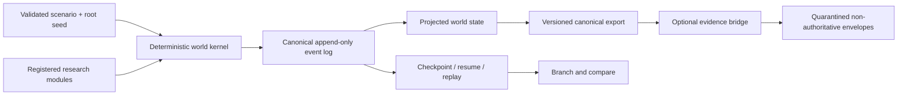

# Aether Simulator

Aether is research software for building deterministic, fictional enterprise
worlds. It supports reproducible simulation, testing, and research. It is not
production-ready, live accepted, a compliance product, or a legal or regulatory
authority.

## Product-depth thesis

1. **Enterprise depth** - one realistic synthetic enterprise.
2. **Ecosystem depth** - enterprises interacting with customers, vendors,
   workers, institutions, and service providers.
3. **Economy depth** - many enterprises and citizens interacting through
   employment, consumption, supply chains, finance, taxation, regulation,
   business formation, failure, and shocks.

This repository implements the deterministic world kernel and a bounded
enterprise-depth research scenario. Enterprise depth remains partial.
Ecosystem and economy depth are not implemented.

## What is implemented

- Versioned JSON contracts for scenarios, events, worlds, checkpoints, and
  exports.
- A deterministic clock, stable event scheduler, cryptographic identifiers,
  and namespaced random substreams.
- Deterministic module lifecycle hooks, append-only events, projections,
  replay, checkpoint/resume, branching, and comparison.
- A credential-free synthetic scenario with fictional entities, a cross-system
  workflow, balances, metrics, and PII-lineage observations.
- Deterministic migration from the public `aether-world.v0.1` fixture.
- An optional evidence bridge that converts synthetic lineage observations into
  quarantined, facts-only, non-authoritative envelopes.

Richer enterprise operations, ecosystem interactions, economy behavior, local
OSS realism, and connected calibration remain future research. Connected
provider performance is not universally validated.

## Five-minute demonstration

Requires Node.js 20 or newer. Docker, credentials, and network services are not
required.

```bash
npm ci
npm run demo
npm run verify
```

The demonstration writes `fixtures/kernel-baseline.export.json` and
`fixtures/kernel-baseline.evidence.json`. Re-running it with the same scenario,
contract version, and seed produces byte-identical output.

The CLI can also run individual lifecycle operations:

```bash
node src/cli.mjs validate scenarios/kernel-baseline.json
node src/cli.mjs run scenarios/kernel-baseline.json
node src/cli.mjs checkpoint scenarios/kernel-baseline.json --tick 2
```

Run `node src/cli.mjs help` for replay, branch, compare, and migrate examples.

## Architecture



## Privacy and limitations

The committed scenarios and fixtures contain only fictional identifiers and
synthetic records. No real personal data is included or accepted by the
demonstration. Synthetic output does not establish real-world compliance.
Provider-connected execution is not included. The baseline module demonstrates
kernel mechanics; it is not a calibrated digital twin or a complete enterprise
model.

Repository status: **active research**.

See [architecture](docs/ARCHITECTURE.md),
[research status](docs/RESEARCH_STATUS.md), and the
[public export manifest](docs/PUBLIC_EXPORT_MANIFEST.md).
