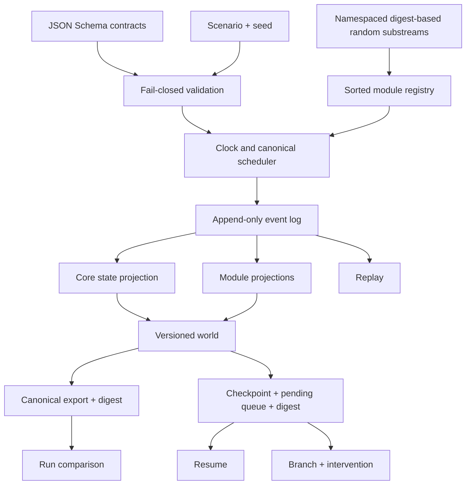
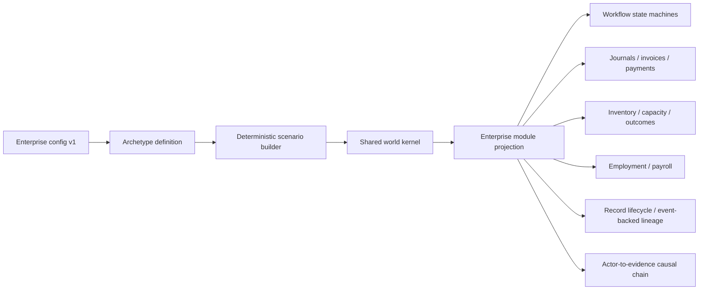
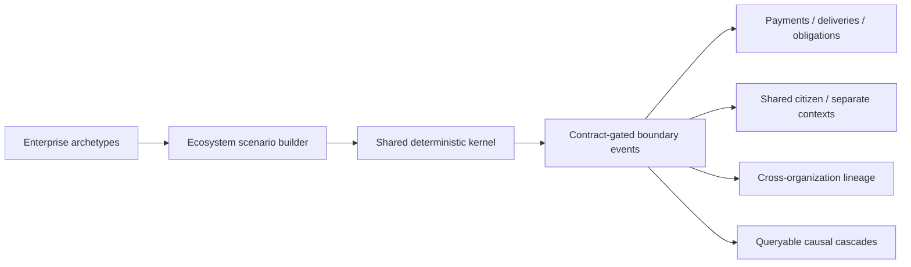
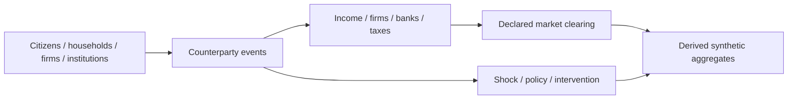
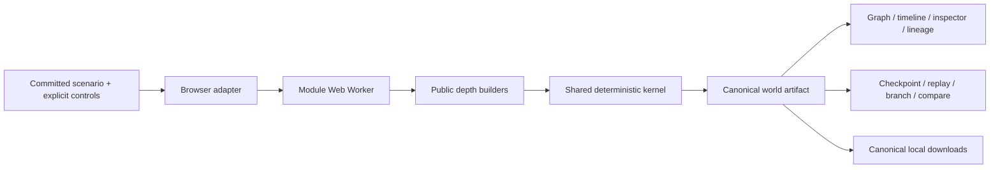

# Architecture

## Boundary

The public core is a deterministic, local simulation kernel. Inputs are a
versioned scenario and an explicit seed. Outputs are synthetic,
non-authoritative canonical JSON artifacts. The kernel does not read the
network, environment credentials, wall clock, or provider state.

## Contracts

The `aether-scenario.v1`, `aether-event.v1`, `aether-world.v1`,
`aether-checkpoint.v1`, and `aether-export.v1` contracts are formal JSON
Schemas under `schemas/kernel/`. Ajv validates them using JSON Schema draft
2020-12. Semantic checks additionally enforce clock bounds, unique identifiers,
declared modules, referenced balances, and event scheduling boundaries.
Unsupported versions fail closed.

The world contains metadata, seed, clock, provenance, people, households,
organizations, institutions, systems, assets, relationships, contracts,
accounts, resources, balances, events, projected state, metrics, observations,
limitations, research status, module versions, and branch provenance.

## Determinism

- Stable identifiers are derived from SHA-256 and retain 128 digest bits.
- Random substreams derive from root seed, module, entity, and purpose. A module
  cannot perturb another namespace merely by consuming more values.
- Modules and same-tick events have canonical ordering.
- Event identity includes its semantic intent, branch, origin, and deterministic
  occurrence index.
- Canonical JSON recursively sorts object keys and supplies byte-stable export
  material.
- Checkpoints and exports include digests; altered checkpoints are rejected.

There are no built-in entity, event, or transaction ceilings. Resource use is a
property of the selected scenario and host environment.

## Module lifecycle

`defineModule` creates a deterministic module with `initialize`, `schedule`,
`reduce`, and `afterEvent` hooks. The kernel sorts registrations by module ID.
Hooks receive cloned state and a restricted deterministic context containing
scenario data, world data, stable identifiers, and namespaced randomness.

Core event projections handle entity or record upserts, balance adjustments,
metrics, and observations. Modules can maintain independent projected state.
Events remain append-only.

## Lifecycle operations

- **Run:** validate, initialize, schedule, drain through a tick, and export.
- **Checkpoint:** stop at a tick and persist world plus the pending queue.
- **Resume:** authenticate the checkpoint digest and continue deterministically.
- **Replay:** rebuild state from the initial scenario and canonical event log.
- **Branch:** resume a checkpoint on a derived branch and schedule declared
  interventions.
- **Compare:** report shared events, collection counts, and balance differences.
- **Migrate:** transform a public `aether-world.v0.1` artifact into versioned
  scenario and world/export contracts without changing the legacy generator.

## Evidence boundary

The optional evidence bridge consumes synthetic lineage observations. It
preserves provenance, emits only factual fields, and keeps every result
non-authoritative and quarantined until an explicit review transition. It
cannot determine legal, regulatory, audit, or compliance outcomes.

## Enterprise Depth

Enterprise Depth is a configuration and module layer on the same kernel:

The five archetypes change departments, roles, systems, assets, offerings,
constraints, resources, capacities, transaction values, workflows, and
outcomes. The scenario builder produces ordinary `aether-scenario.v1` input;
there is no second engine.

Every enterprise event records a deterministic causal step linking actor,
action, workflow, system, resource, financial, and data consequences.
Projection rejects undeclared workflow transitions, unbalanced journals,
negative inventory without backorder permission, capacity violations, payroll
without active employment, invoice overpayment, and missing causal
predecessors. Data events emit PII-lineage observations referencing their
actual simulation event.

## Ecosystem Depth

Ecosystem configurations reuse Enterprise Depth archetype structure and
register `enterprise-operations` plus `ecosystem-operations` on the same
kernel. Cross-boundary events are rejected unless an active declared contract
covers the owner and every affected organization.

Construction batching is deterministic and absent from semantic configuration,
so partition size cannot change scenario or world output.

## Product-depth boundary

Enterprise, Ecosystem, and Economy Depth are implemented as configurable,
tested research scenarios with explicit simplifications. Economy aggregates
are derived from entity-level events:

Partitioned construction is implemented without changing semantic output.
Worker-parallel execution remains future engineering.
Technical execution choices are named deterministic execution mode, local OSS
realism mode, and connected calibration mode; they are not product depths.

## Browser studio

The browser does not contain a second simulation engine. `app/runtime.mjs`
adapts browser commands to the public builders and kernel, while the worker
isolates synchronous simulation from the main thread. Static application code
does not fetch providers, accept uploads, or persist server-side state.
Ajv’s ten contract validators are generated as a standalone ESM module and
checked for drift, avoiding runtime code generation under the content policy.

## Engineering quality gate

The minimum supported Node.js release runs the complete `npm run verify:ci`
gate: deterministic acceptance, formal contracts, fixture validation and
regeneration, repository and workflow policy, sensitive-content scanning,
package-boundary validation, and dependency audit. Additional jobs exercise
current Node.js releases, Windows portability, and a complete Chromium studio
journey. Actions use read-only permissions and commit-pinned dependencies. See
`docs/CI_CD.md`.
