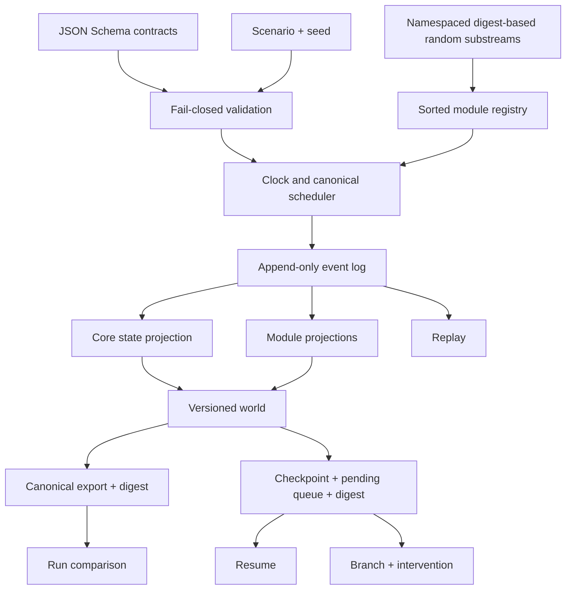
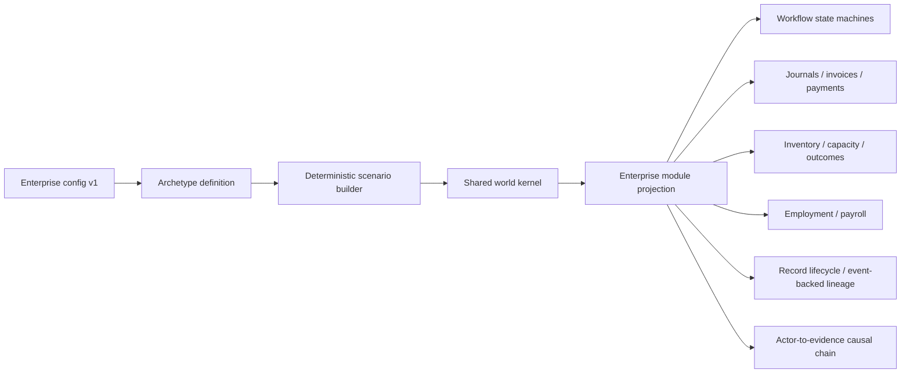
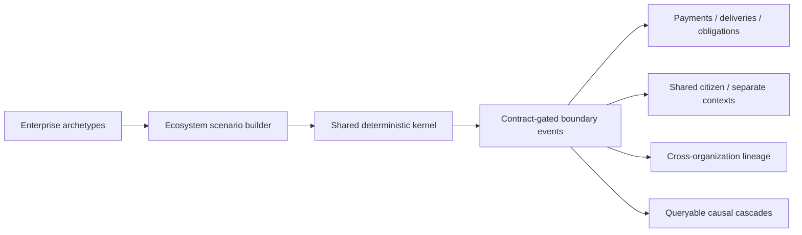
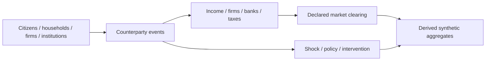
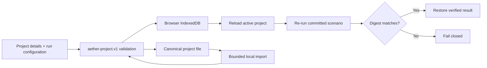
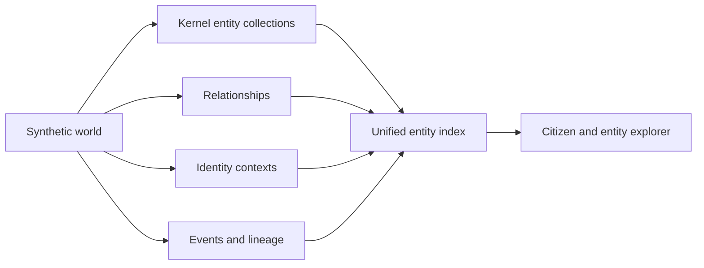
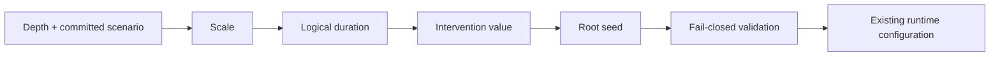
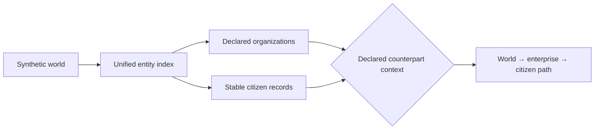
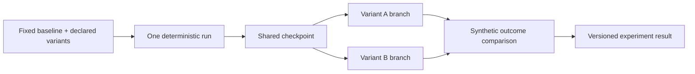
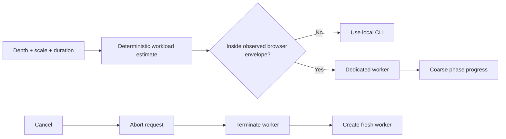

# Architecture

## Boundary

The public core is a deterministic, local simulation kernel. Inputs are a
versioned scenario and an explicit seed. Outputs are synthetic,
non-authoritative canonical JSON artifacts. The kernel does not read the
network, environment credentials, wall clock, or provider state.

## Contracts

The `aether-scenario.v1`, `aether-event.v1`, `aether-world.v1`,
`aether-checkpoint.v1`, and `aether-export.v1` contracts are formal JSON
Schemas under `schemas/kernel/`. Ajv validates them using JSON Schema draft
2020-12. Semantic checks additionally enforce clock bounds, unique identifiers,
declared modules, referenced balances, and event scheduling boundaries.
Unsupported versions fail closed.

The world contains metadata, seed, clock, provenance, people, households,
organizations, institutions, systems, assets, relationships, contracts,
accounts, resources, balances, events, projected state, metrics, observations,
limitations, research status, module versions, and branch provenance.

## Determinism

- Stable identifiers are derived from SHA-256 and retain 128 digest bits.
- Random substreams derive from root seed, module, entity, and purpose. A module
  cannot perturb another namespace merely by consuming more values.
- Modules and same-tick events have canonical ordering.
- Event identity includes its semantic intent, branch, origin, and deterministic
  occurrence index.
- Canonical JSON recursively sorts object keys and supplies byte-stable export
  material.
- Checkpoints and exports include digests; altered checkpoints are rejected.

There are no built-in entity, event, or transaction ceilings. Resource use is a
property of the selected scenario and host environment.

## Module lifecycle

`defineModule` creates a deterministic module with `initialize`, `schedule`,
`reduce`, and `afterEvent` hooks. The kernel sorts registrations by module ID.
Hooks receive cloned state and a restricted deterministic context containing
scenario data, world data, stable identifiers, and namespaced randomness.

Core event projections handle entity or record upserts, balance adjustments,
metrics, and observations. Modules can maintain independent projected state.
Events remain append-only.

## Lifecycle operations

- **Run:** validate, initialize, schedule, drain through a tick, and export.
- **Checkpoint:** stop at a tick and persist world plus the pending queue.
- **Resume:** authenticate the checkpoint digest and continue deterministically.
- **Replay:** rebuild state from the initial scenario and canonical event log.
- **Branch:** resume a checkpoint on a derived branch and schedule declared
  interventions.
- **Compare:** report shared events, collection counts, and balance differences.
- **Migrate:** transform a public `aether-world.v0.1` artifact into versioned
  scenario and world/export contracts without changing the legacy generator.

## Evidence boundary

The optional evidence bridge consumes synthetic lineage observations. It
preserves provenance, emits only factual fields, and keeps every result
non-authoritative and quarantined until an explicit review transition. It
cannot determine legal, regulatory, audit, or compliance outcomes.

## Enterprise Depth

Enterprise Depth is a configuration and module layer on the same kernel:

The five archetypes change departments, roles, systems, assets, offerings,
constraints, resources, capacities, transaction values, workflows, and
outcomes. The scenario builder produces ordinary `aether-scenario.v1` input;
there is no second engine.

Every enterprise event records a deterministic causal step linking actor,
action, workflow, system, resource, financial, and data consequences.
Projection rejects undeclared workflow transitions, unbalanced journals,
negative inventory without backorder permission, capacity violations, payroll
without active employment, invoice overpayment, and missing causal
predecessors. Data events emit PII-lineage observations referencing their
actual simulation event.

## Ecosystem Depth

Ecosystem configurations reuse Enterprise Depth archetype structure and
register `enterprise-operations` plus `ecosystem-operations` on the same
kernel. Cross-boundary events are rejected unless an active declared contract
covers the owner and every affected organization.

Construction batching is deterministic and absent from semantic configuration,
so partition size cannot change scenario or world output.

## Product-depth boundary

Enterprise, Ecosystem, and Economy Depth are implemented as configurable,
tested research scenarios with explicit simplifications. Economy aggregates
are derived from entity-level events:

Partitioned construction is implemented without changing semantic output.
Worker-parallel execution remains future engineering.
Technical execution choices are named deterministic execution mode, local OSS
realism mode, and connected calibration mode; they are not product depths.

## Product shell

`app/routes.mjs` is the single registry for browser product destinations. It
drives the desktop rail, orientation index, keyboard command navigator,
static-host-compatible hash deep links, and active-route state. Routes select
existing simulation surfaces; they do not introduce a second runtime or imply
that later project, builder, scale, zoom, or analysis work is complete.

## Browser studio

The browser does not contain a second simulation engine. `app/runtime.mjs`
adapts browser commands to the public builders and kernel, while the worker
isolates synchronous simulation from the main thread. Static application code
does not fetch providers or persist server-side state. The only imported format
is a bounded, versioned local project document that references committed
scenarios and is normalized through an exact allowlist.
Ajv’s ten contract validators are generated as a standalone ESM module and
checked for drift, avoiding runtime code generation under the content policy.

## Local project workspace

Project identifiers and revisions are workspace metadata. They do not enter the
simulation kernel. Project files retain configuration and a last-run digest,
not a generated world, and are never transmitted by the application.

## Unified entity view

`src/entities/unified.mjs` builds a deterministic index over existing kernel
entities, relationships, ecosystem identity contexts, events, lineage facts,
and provenance. It reuses every kernel identifier and does not mutate the
world.

## Scenario blueprint

`src/scenarios/blueprint.mjs` validates a fixed visual topology and compiles it
to the existing browser runtime payload.

The blueprint is declarative JSON and cannot contain user code, provider
configuration, or executable nodes.

## Scenario library

`src/scenarios/library.mjs` is the browser catalog source of truth. Its
`aether-scenario-library.v1` entries map every displayed card to one committed
depth and scenario identifier. The runtime select catalog is derived from the
same entries, preventing a discoverable example from drifting away from an
executable scenario.

Filtering is a pure local projection. The guided first run is a frozen,
version-controlled configuration that resolves through the same runtime form;
it does not bypass validation or introduce a separate execution path.

## Semantic zoom projection

`src/entities/semantic-zoom.mjs` derives a deterministic navigation model from
the unified entity index. It groups organizations at the world level and
connects citizens only when an existing relationship or identity context names
that organization.

The projection never clones a citizen, infers a real identity, or invents a
membership. A citizen can appear in several enterprise paths while retaining
one kernel identifier and one unified record.

## Analysis projection

`src/analysis/workspace.mjs` derives `aether-analysis.v1` from a completed
synthetic world export. It counts emitted entities, events, relationships,
observations, lineage facts, entity kinds, event kinds, and explicit `causes`
edges. The result is deterministic for the same canonical world.

The projection does not fit a statistical model, calibrate parameters, infer
missing links, or estimate causal effects. World limitations are carried into
the analysis result and the browser keeps that interpretation boundary visible.

## Scenario laboratory

The accepted laboratory family uses the economy policy-intervention scenario.
All variants share depth, scenario, seed, scale, and duration; only the declared
intervention varies.

## Browser runtime control

`app/runtime-control.mjs` derives a deterministic workload estimate from depth,
scale, and duration. Its interactive envelope matches the largest committed
benchmark observations: enterprise scale 100, ecosystem scale 10, and economy
scale 25 at 80 logical ticks. These are browser safety boundaries, not limits
in the kernel, scenario builders, benchmarks, or CLI.

The worker reports request acceptance, synchronous kernel execution, and result
validation as coarse phases. It cannot report event-level percentages while
the synchronous kernel is running. Cancellation is therefore implemented at
the process boundary: an `AbortSignal` settles the UI request, the active worker
is terminated, and a new worker is created for the next operation.

Worker `error` and `messageerror` events reject their matching request and
remove all listeners. Manual reset uses the same replacement boundary and
discards only transient simulation state; project persistence is independent.

## Engineering quality gate

The minimum supported Node.js release runs the complete `npm run verify:ci`
gate: deterministic acceptance, formal contracts, fixture validation and
regeneration, repository and workflow policy, sensitive-content scanning,
package-boundary validation, and dependency audit. Additional jobs exercise
current Node.js releases, Windows portability, and a complete Chromium studio
journey. Actions use read-only permissions and commit-pinned dependencies. See
`docs/CI_CD.md`.
