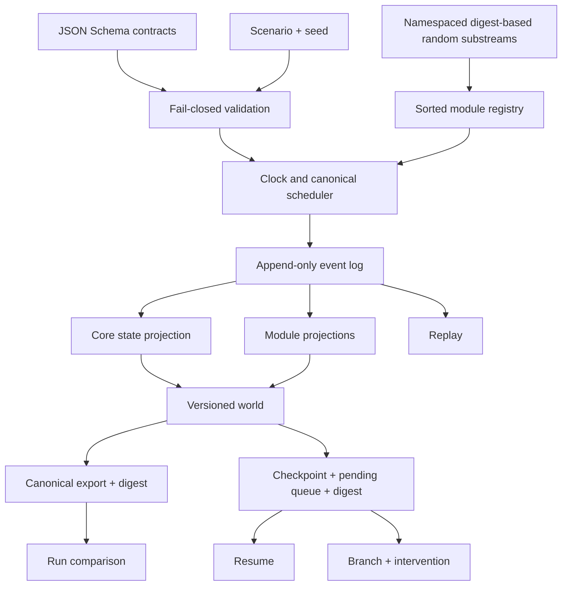

# Architecture

## Boundary

The public core is a deterministic, local simulation kernel. Inputs are a
versioned scenario and an explicit seed. Outputs are synthetic,
non-authoritative canonical JSON artifacts. The kernel does not read the
network, environment credentials, wall clock, or provider state.

## Contracts

The `aether-scenario.v1`, `aether-event.v1`, `aether-world.v1`,
`aether-checkpoint.v1`, and `aether-export.v1` contracts are formal JSON
Schemas under `schemas/kernel/`. Ajv validates them using JSON Schema draft
2020-12. Semantic checks additionally enforce clock bounds, unique identifiers,
declared modules, referenced balances, and event scheduling boundaries.
Unsupported versions fail closed.

The world contains metadata, seed, clock, provenance, people, households,
organizations, institutions, systems, assets, relationships, contracts,
accounts, resources, balances, events, projected state, metrics, observations,
limitations, research status, module versions, and branch provenance.

## Determinism

- Stable identifiers are derived from SHA-256 and retain 128 digest bits.
- Random substreams derive from root seed, module, entity, and purpose. A module
  cannot perturb another namespace merely by consuming more values.
- Modules and same-tick events have canonical ordering.
- Event identity includes its semantic intent, branch, origin, and deterministic
  occurrence index.
- Canonical JSON recursively sorts object keys and supplies byte-stable export
  material.
- Checkpoints and exports include digests; altered checkpoints are rejected.

There are no built-in entity, event, or transaction ceilings. Resource use is a
property of the selected scenario and host environment.

## Module lifecycle

`defineModule` creates a deterministic module with `initialize`, `schedule`,
`reduce`, and `afterEvent` hooks. The kernel sorts registrations by module ID.
Hooks receive cloned state and a restricted deterministic context containing
scenario data, world data, stable identifiers, and namespaced randomness.

Core event projections handle entity or record upserts, balance adjustments,
metrics, and observations. Modules can maintain independent projected state.
Events remain append-only.

## Lifecycle operations

- **Run:** validate, initialize, schedule, drain through a tick, and export.
- **Checkpoint:** stop at a tick and persist world plus the pending queue.
- **Resume:** authenticate the checkpoint digest and continue deterministically.
- **Replay:** rebuild state from the initial scenario and canonical event log.
- **Branch:** resume a checkpoint on a derived branch and schedule declared
  interventions.
- **Compare:** report shared events, collection counts, and balance differences.
- **Migrate:** transform a public `aether-world.v0.1` artifact into versioned
  scenario and world/export contracts without changing the legacy generator.

## Evidence boundary

The optional evidence bridge consumes synthetic lineage observations. It
preserves provenance, emits only factual fields, and keeps every result
non-authoritative and quarantined until an explicit review transition. It
cannot determine legal, regulatory, audit, or compliance outcomes.

## Product-depth boundary

The kernel is infrastructure for later product depths; it is not evidence that
those depths exist. A bounded enterprise example is present. Comprehensive
enterprise depth is partial, and ecosystem and economy depth are unimplemented.
Technical execution choices are named deterministic execution mode, local OSS
realism mode, and connected calibration mode; they are not product depths.
