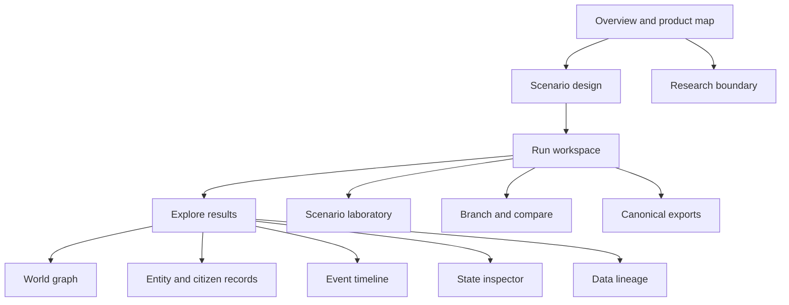

# Information architecture

## Navigation model

The browser product uses stable hash routes so a static deployment can deep-link
without server rewrites.

| Route | User question | Present destination |
|---|---|---|
| `#/overview` | What is this product and what is available? | product map and status |
| `#/design` | Which tested premise should I start from? | scenario selection |
| `#/run` | How do I configure and execute a world? | run workspace |
| `#/lab` | How do declared interventions differ from one fixed baseline? | scenario laboratory |
| `#/explore/<view>` | What happened and why? | entities, graph, timeline, inspector, or lineage |
| `#/compare` | What changed between branches? | run lifecycle; requires a result |
| `#/export` | How do I reproduce or review this run? | export view; requires a result |
| `#/boundary` | What must I not infer? | research boundaries |

The product rail is the primary desktop navigation. On compact screens the
brand and command navigator remain available in the sticky header. The command
navigator exposes the same route model and result views; it is not a separate
taxonomy.

## Content hierarchy

## Domain vocabulary

- **Product depth:** enterprise, ecosystem, or economy scope.
- **Scenario:** versioned deterministic input describing a fictional premise.
- **World:** projected synthetic state produced by a scenario run.
- **Entity:** a fictional person, household, organization, institution, system,
  asset, or other declared world object.
- **Citizen:** a synthetic person with one or more contexts and relationships.
- **Role context:** the citizen's relationship to a particular enterprise or
  institution; it is not a real identity.
- **Event:** immutable causal fact in simulation time.
- **Run:** one execution identified by version, scenario, and seed.
- **Branch:** a deterministic continuation with an explicit intervention.
- **Artifact:** canonical local output used for reproduction and review.

## State model

Product areas are either available, require a completed run, or planned.
Simulation execution can be idle, running, complete, paused, replaying,
checkpointing, branching, comparing, cancelled, or error. Later work packages
may add project loading, validation, and recovery states without renaming the
core simulation lifecycle.

## Evolution rule

New product areas must extend the shared route registry in `app/routes.mjs`,
define an honest availability state, and preserve a direct path back to the
scenario and run that produced any result. Integrations are deferred until the
standalone 1.0 product acceptance gate.
